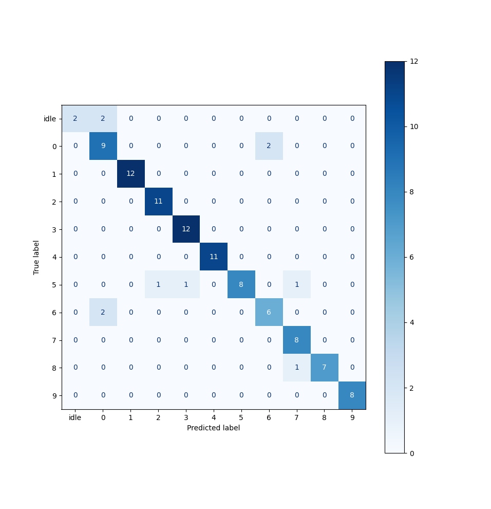
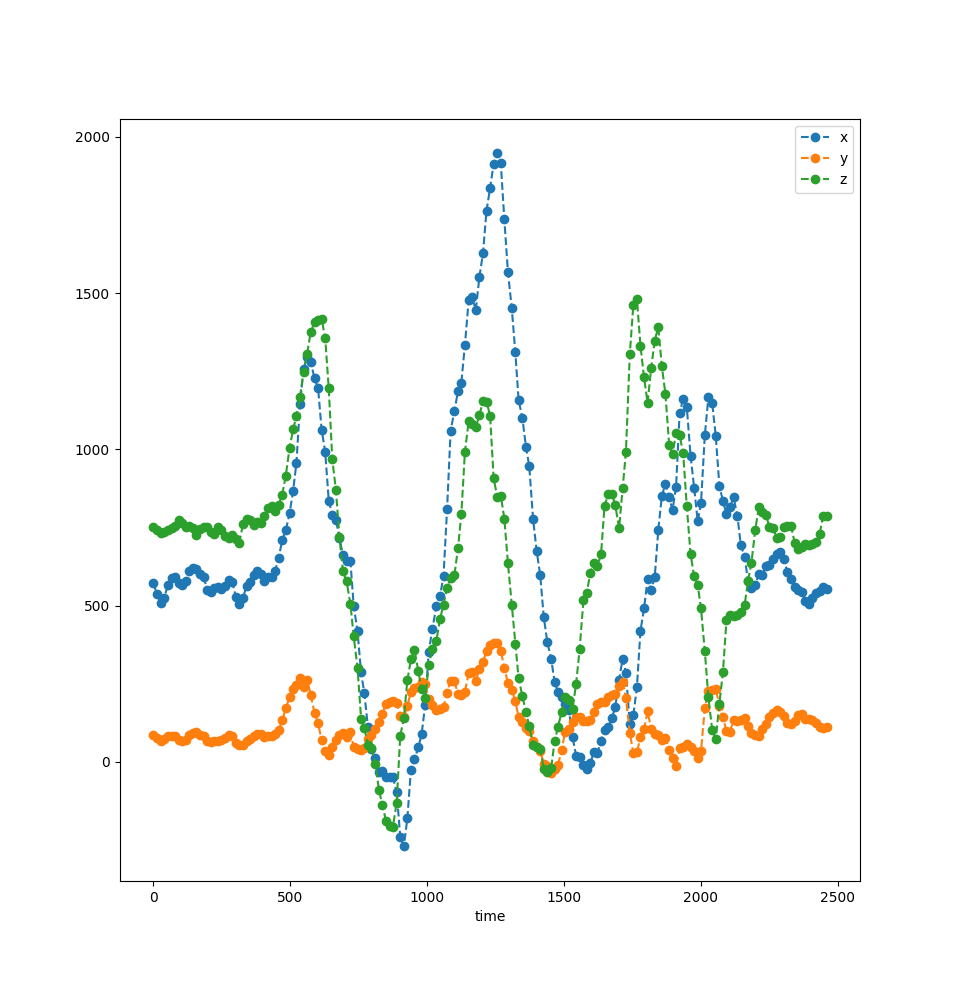
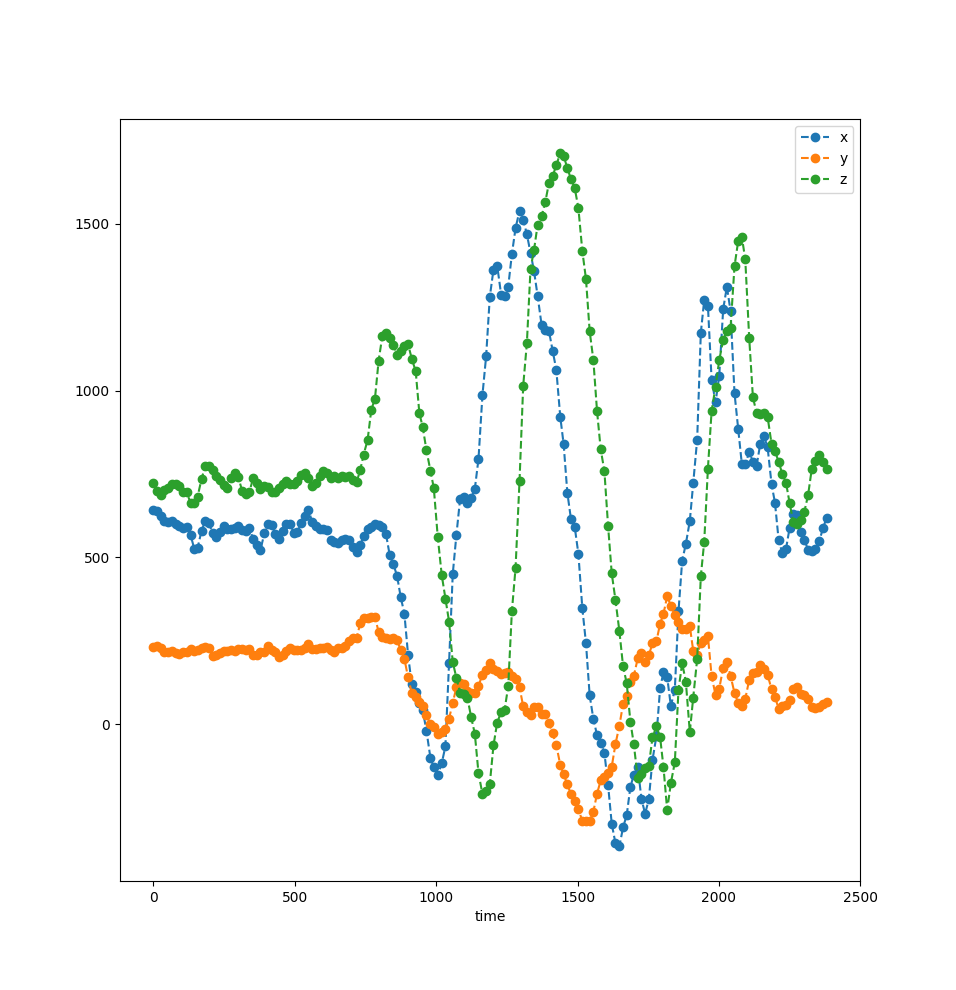

# AI on the edge gesture recognition running on ESP32
*Leveraging keras/tensorflow with tflite-micro using 1D-CNNs*

## About
This repo contains a full workflow to enable an ESP32+Accelerometer setup for predicting hand-written gestures/characters in the air.
The workflow consists of:

1) Sampling a dataset containing the gestures of interest
2) Training a small 1D-CNN with keras
3) Converting the model into a tflite file
4) Converting the tflite file a .h header file
5) Compiling the model into an inference firmware
6) Happy predicting!

### Consfusion matrix of provided model
*Accuracy about 90%*

## Hardware components needed
- Breadboard
- ESP32-Module
- Accelerometer (I'm using an BNO055 IMU).

## Software components needed
- Linux (e.g. Debian)
- Python 3.11 (I tested only with 3.11.8).
- ESP-IDF
- xxd

## Getting started with inference
An example network is provided (firmware/main/model.h), so sampling and training are optional (Steps 1-4 above).
- Setup the ESP-IDF as described [here](https://docs.espressif.com/projects/esp-idf/en/latest/esp32/get-started/linux-macos-setup.html)
- Setup the build environment`$ get_idf`
- Clone this repo
- `$ cd esp32-gesture-recognition/firmware`
- `$ idf.py build`
- Plug in your ESP32 board via USB. Wire the BNO055 accelerometer via I2C pullups like the following: SCL-> Pin 14, SDA -> Pin 27. Connect ground and +3.3V
- `$ idf.py flash monitor`
- "Write" gestures from 0-9 in the air and watch the output. Be sure to keep the xy-Plane parallel to the floor.

## Sampling your own dataset
- Get the latest Micropython-Firmware from [here](https://micropython.org/download/ESP32_GENERIC/)
- Install the esptool.py as described and flash it to your board as described there.
- `$ cd esp32-gesture-recognition`
- In a virtualenv install mpremote: `pip install mpremote`
- Copy the sampling script onto your board: `$ mpremote a0 cp dataset/esp32_micropython/main.py :`. `a0` denotes your USB tty-device.
- Reset your board.
- Install the requirements: `$ pip install -r requirements.txt`
- `$ cd dataset`
- Adapt collect_samples.py to match your tty-device.
- `$ python collect_samples.py`
- Follow the instructions to sample your gestures. Gestures will be written into the `samples` directory.
- Optionally, visualize your collected samples:
- `$ python visualize.py`

###  Letter "b"

###  Letter "d"

## Train your own model
- `$ cd esp32-gesture-recognition`
- Install the requirements: `$ pip install -r requirements.txt`
- `$ cd network`
- Train the model
- `$ python train.py`
- Convert to tflite
- `$ python convert.py`
- Convert to a header file
- `$ xxd -i model.tflite > ../firmware/main/model.h`
- Compile and flash as described above.
